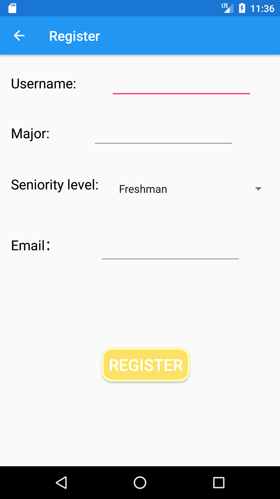
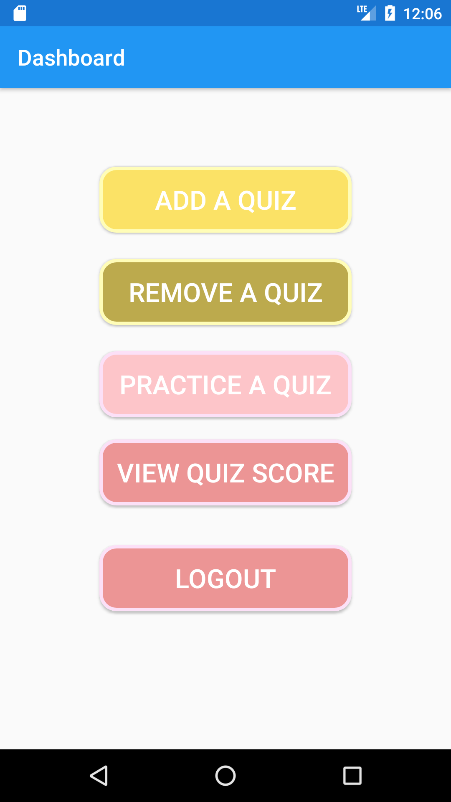
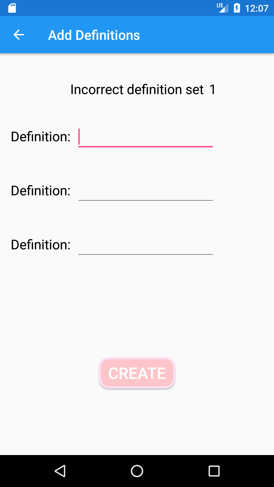
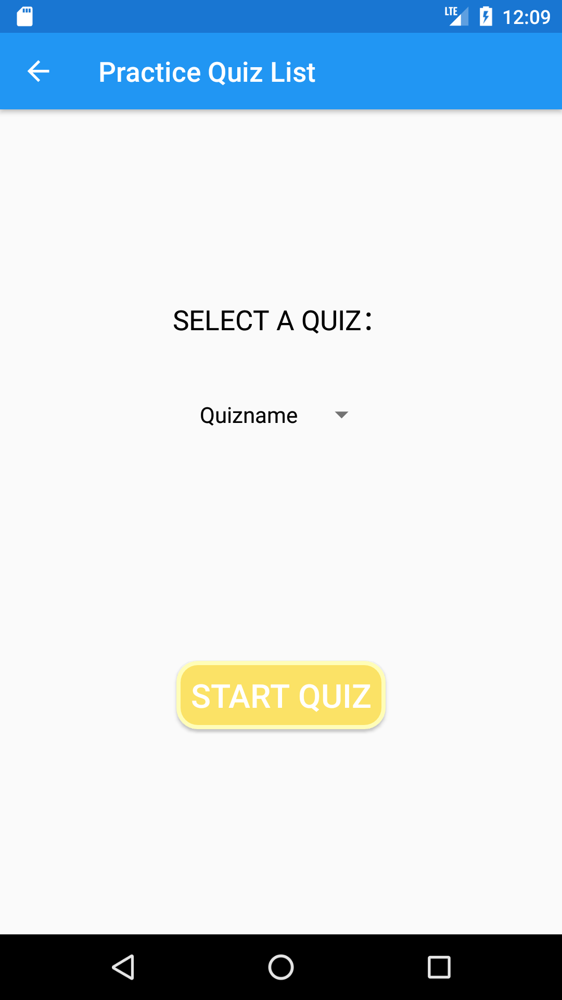
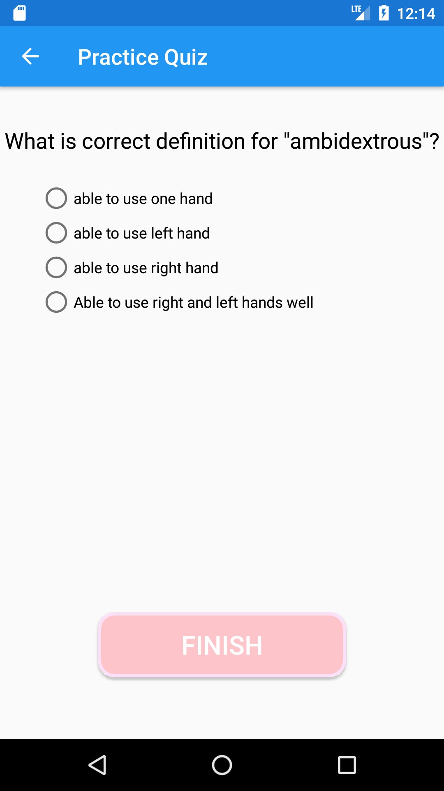
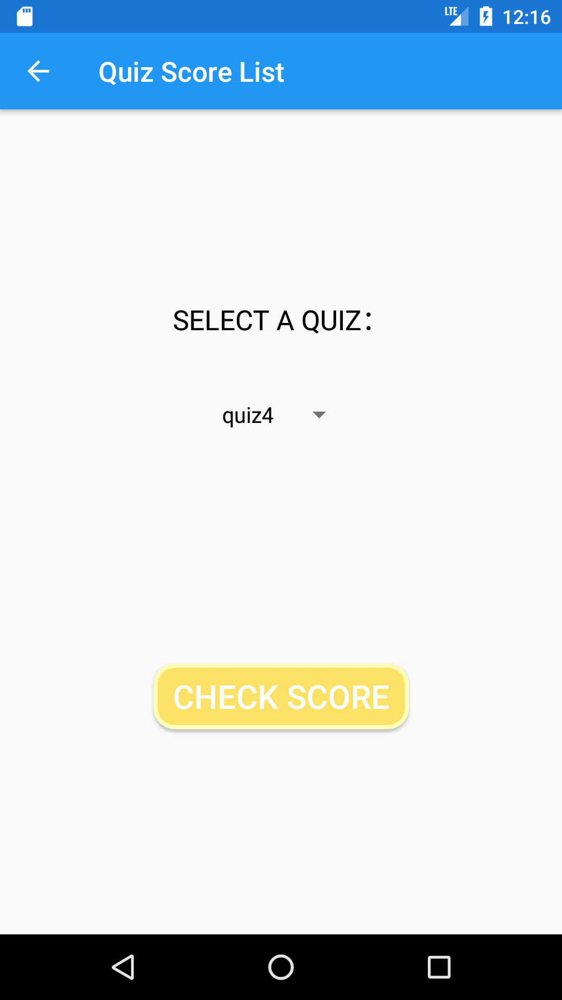

# Design Document
**Author**: Team 48

## 1 Design Considerations

### 1.1 Assumptions

- Background: One of our professors is looking for a way to help students study vocabulary terms for their classes and challenge one another. The Unified Software Process model should be followed to develop the application.

- List of Requirements
##### Functional Requirements
   1. When starting the application, a user can choose whether to (1) log in as a specific student or (2) register as a new student.  
     a. To register as a new student, the user must provide the following student information:
      (i) A unique username   
      (ii) A major   
      (iii) A seniority level (i.e., freshman, sophomore, junior, senior, or grad)   
      (iv) An email address   
b. The newly added student is immediately created in the system.   
 c. For simplicity, there is no password creation/authentication; that is, selecting or entering a student username is sufficient to log in as that student.  
d. Also for simplicity, student and quiz information is local to a device.

   2. The application allows students to (1) add a quiz, (2) remove a quiz they created, (3) practice quizzes, and (4) view the list of quiz score statistics.

   3. To add a quiz, a student must enter the following quiz information:   
     a. Unique name   
     b. Short description   
     c. List of N words, where N is between 1 and 10,  together with their definitions    
     d. List of N * 3 incorrect definitions, not tied to any particular word, where N is the number of words in the quiz.

   4. To remove a quiz, students must select it from the list of the quizzes they created. Removing a quiz must also remove the score statistics associated with that quiz.

   5. To practice a quiz, students must select it from the list of quizzes created by other students.

   6. When a student is practicing a quiz, the application must do the following:   
     a. Until all words in the quiz have been used in the current practice session:
      (i) Display a random word in the quiz word list.   
      (ii) Display four definitions, including the correct definition for that word (the other three definitions must be randomly selected from the union of (1) the set of definitions for the other words in the quiz and (2) the set of incorrect definitions for the quiz.   
      (iii) Let the student select a definition and display “correct” (resp., “incorrect”) if the definition is correct (resp., incorrect).   
      b. After every word in the quiz has been used, the student will be shown the percentage of words they correctly defined, and this information will be saved in the quiz score statistics for that quiz and student.   
     c. Every word in a quiz should be shown once and only once.

   7. Requirement 7 (quiz score statistics):   
     a. The quiz score statistics for a student S should list all quizzes, whether they were played by S or not, and including the quizzes created by S.   
     b. The quizzes not played by S can be displayed in any order (after the ones played).   
     c. For quizzes not played by S, only the names of the first three students to score 100% on the quiz should be displayed.   
     d. The names displayed (and used to sort) in the statistics for the first three students to score 100% on the quiz can be either their usernames or their real names.

##### Non-Functional Requirements:
   8. The user interface must be intuitive and responsive.

   9. The performance of the game should be such that students do not experience any considerable lag between their actions and the response of the application.

### 1.2 Constraints
  - The program should be use on a locally on a shared Tablet
  - The information should be local to the device (stored locally)
  - The application must be built using the Java language (Java(TM) SE Runtime Environment (build 1.8.0_181-b13))
  - Developers should use Android Studio IDE to develop the application
  - Developers must use git version control system
  - The application repository will be hosted on Georgia Tech Github
  [link](https://github.gatech.edu/gt-omscs-se-2018fall/6300Fall18Team48)
  - Any third party libraries used must be included in the repository

### 1.3 System Environment
  - Hardware: Generic Tablet running Android OS
  - Software: Android OS Backwards compatible with Android 6.0 (API23 - Marshmallow)

## 2 Architectural Design

### 2.1 Component Diagram

### 2.2 Deployment Diagram

The deployment diagram is not necessary for this system as there is only one hardware device where the application will be deployed.

## 3 Low-Level Design

There are four components in our design. Student is a component that provide the user interface so the user could "register", "log in" and also "add", "practice" or "remove" a quiz component.

Quiz component provide the interface for the student to add a quiz, remove a quiz, practice a quiz and also check score statistics.

Student and Quiz component need to get access control capabilities, which is provided by the Authentication component. Student and Quiz Component also need Persistance capabilities, which is provided by the Persistance Component.

### 3.1 Class Diagram

### 3.2 Other Diagrams

sequence diagram

## 4 User Interface Design

#### 1. Access SDP Vocab Quiz Application

#### 2. Registration Page

#### 3. Login Page

#### 4. Quiz Dashboard

#### 5. Add Quiz Screen

#### 6. Add Word and Definition Screen

#### 7. Add Incorrect Definition Screen

#### 8. Select Quiz Screen

#### 9. Practice Quiz Screen

#### 10. Quiz Result Screen

#### 11. Remove Quiz Screen

#### 12. View Quiz Score Screen

#### 13. View Quiz Score Details Screen

