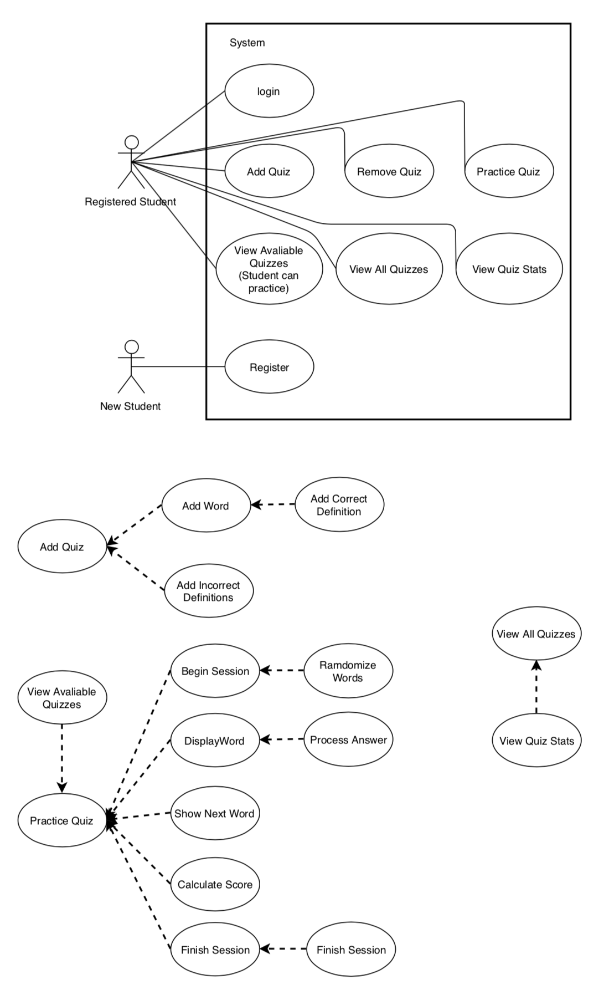

# Use Case Model
**Author**: Team 48

## 1 Use Case Diagram

## 2 Use Case Descriptions

- Register
  - Requirements: Alow the student to register in the system
  - Pre-conditions: Student is not registered
  - Post-Condition: Student should be registered
  - Scenarios: 
      - a) Student enters the following information: studentname, major, (i.e., freshman, sophomore, junior, senior, or grad), email address
      - b) If student is not registered, register the student, else display error.

- Login
  - Requirements: Alow the student to use the featured of the system
  - Pre-conditions: Student is registered
  - Post-Condition: Student has features of the system available
  - Scenarios:
      - a) Student enters the following information: studentname
      - b) If student is registered, the student logs in the system, else display error.

- Add Quiz
  - Requirements: Student must be able to add a new quiz in the system, this includes words, correct definitions and incorrect definitions
  - Pre-conditions: Student is logged in
  - Post-Condition: A quiz is added to the system
  - Scenarios:
      - a) Student selects to add a quiz
      - b) Student enters the following information: name of the quiz, short description, list of words (N) with a correct definition (N has to be between 1 and 10 and the user will be able to add/remove definitions between this range), list of 3 * N of incorrect definitions
      - c) If all information provided is correct the quiz is added to the system and the student else display error.

- Remove Quiz
  - Requirements: Student must be able to remove their quizzes from the system
  - Pre-conditions: Student is logged in and has created the quiz to be removed
  - Post-Condition: The quiz is removed from the system
  - Scenarios:
      - a) Student selects to remove a quiz
      - b) the quiz is removed from the system

- View Available Quizzes
  - Requirements: Student should be able to see the quizzes created by other students
  - Pre-conditions: Student is logged in and other students have created at least one quiz
  - Post-Condition: Available quizzes are shown to the student
  - Scenarios:
      - a) Student selects to view the quizzes he/she can practice
      - b) The available quizzes are presented to the student by the system

- Practice Quiz
  - Requirements: Student should be able to practice a particular quiz
  - Pre-conditions: Student is logged in, other students have created at least one quiz and the student has selected a particular quiz to practice
  - Post-Condition: The student practice, after the practice is finished a quiz score is calculated and saved in the system
  - Scenarios:
      - a) Student selects to practice a quiz
      - b) The system ramdomizes the words and displays the first word with one correct definition and three ramdom incorrect definitions
      - c) Student selects a definition
      - d) if the definition is correct system shows correct else system shows incorrect
      - e) Student select next question
      - f) The Next question is displayed
      - g) c to f is repeated until the last word is reached
      - h) When the student has provided all the answers, instead of next word the system displays finish
      - i) When the student selects to finish the quiz, student quiz score is calculated and saved
      - j) The user is taken back to the list of available quizzes.

- View All Quizzes
  - Requirements: Student should be able to see all the quizzes in the system sorted by last played by the student.
  - Pre-conditions: Student is logged in and there is at least one quiz in the system
  - Post-Condition: All quizzes are shown to the student
  - Scenarios:
      - a) Student selects to view all the quizzes in the system
      - b) The available quizzes are presented to the student by the system

- View Quiz Stats
  - Requirements: Student should be able to see the stats for a particular quiz
  - Pre-conditions: Student is logged in and has selected a quiz to view the stats.
  - Post-Condition: (1) the student’s first score and when it was achieved (date and time), (2) the student’s highest score and when it was achieved (date and time), and (3) the names of the first three students to score 100% on the quiz, ordered alphabetically.
  - Scenarios:
      - a) Student selects a particular quiz to view the stats
      - b) the stats are displayed to the student