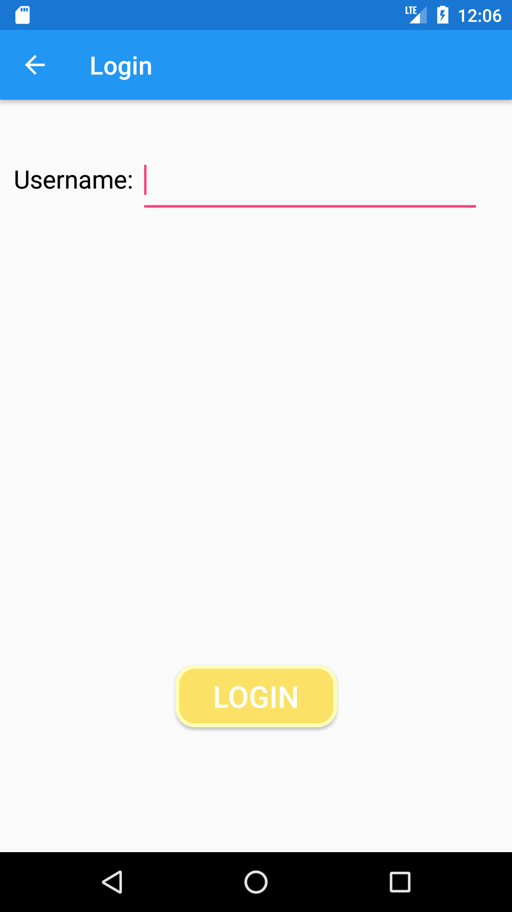

# SDP Vocab Quiz - User Manual
## Team 48
## 1. Overview
The SDP Vocabulary Quiz Manager is an Android application for sharing and practicing vocabulary quizzes.

## 2. Access SDP Vocab Quiz

- Open the SDP Vocab Quiz to start using the application.
- User has two options: Log in and register.
- Registration is required for new users to use the application.

## 3. Register

- All fields are required for registration.
- Input all fields then click submit to register.

## 4. Login

- Input registered username to log in.

## 5. Quiz Dashboard

- Quiz dashboard has four options: Add a quiz, remove a quiz, practice quiz,
and view quiz score.
- Add a quiz: Click add a quiz to create a quiz to be taken by other users.
- Remove a quiz: Click remove a quiz to remove quiz created by logged in user.
- Practice a quiz: Click practice quiz to practice quizzes created by other
users

## 6. Add Quiz

- Input "Quiz Name" for the name of the quiz
- Input "Description" for description of the quiz
- Input number between 1 and 10 in "Number of questions" for number of questions
in quiz
- Click next to add quiz questions
- Click logout to log out from current user

## 7. Add Word and Definition for Quiz

- Input word and definition in corresponding fields to register words and
definitions
- Click next to add next word and definition
- Repeat this step for number of words in quiz

## 8. Add Incorrect Definition for Quiz

- Input three incorrect definitions to register incorrect definitions for quiz
- Click submit when complete to successfully add incorrect definitions

## 9. Select Quiz

- Select a quiz from the dropdown to select a quiz to practice
- Click "Start Quiz" to start practicing a quiz

## 10. Practice Quiz

- For each word displayed in the screen, select definition then click submit to
move to next word
- When the correct definition is selected, "Correct" message will show to
indicate correct definition
- Repeat this step for number of words in quiz

## 11. Quiz Result

- Quiz result will show when the quiz ends.
- Click finish to move to quiz dashboard

## 12. Remove Quiz

- User will be able to remove quiz authored by user
- Select a quiz name from the dropdown to select quiz to be deleted
- Click "Remove" to successfully remove the quiz

## 13. View Quiz Score

- Select a quiz from the dropdown to view quiz score
- Click "Check score" to move to quiz score

## 14. View Quiz Score Details

- This screen shows quiz statistics for quiz selected from view quiz score
- This screen shows quiz name, student created by, first score and time,
highest score and time
- This screen also displays first three students to score 100% on the quiz
